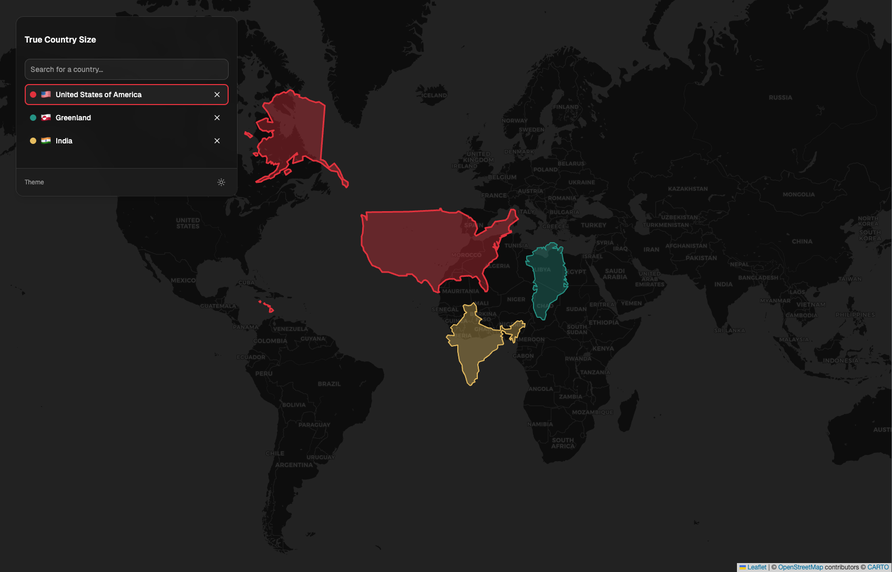

# True Size Map

**Live:** [true-map-size.vercel.app](https://true-map-size.vercel.app/)



A React app that visualizes the true geographic size of countries by overlaying them on an interactive map using react-leaflet with OpenStreetMap/CARTO tiles. Search for countries, place them on the map, and drag them across latitudes to see how Mercator distortion affects their apparent size. Multiple countries can be compared simultaneously.

## How It Works

The Mercator projection exaggerates the size of landmasses at higher latitudes (e.g., Greenland appears as large as Africa, when in reality Africa is 14x larger). This app corrects for that distortion using spherical geometry: each country's vertices are stored as angular distances and headings from its centroid, then recomputed at any target latitude using spherical destination math. Countries visually resize in real-time as you drag them across the map.

## Getting Started

### Prerequisites

- Node.js

### Setup

```bash
npm install
```

### Development

```bash
npm run dev
```

### Build

```bash
npm run build
```

### Other Commands

- `npm run lint` -- ESLint
- `npm run preview` -- preview production build
- `node scripts/process-countries.mjs` -- regenerate `public/countries.json` from Natural Earth GeoJSON

## Tech Stack

- React 19
- TypeScript 6
- Vite 8
- Tailwind CSS v4
- shadcn/ui
- react-leaflet / Leaflet
- OpenStreetMap + CARTO tiles
